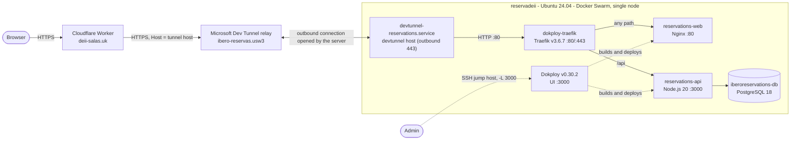

# Deployment

Production deployment of IberoReservations on the university server
`reservadeii`. For local development see the [README](../README.md); for day-2
operations see the [RUNBOOK](RUNBOOK.md); for the reasoning behind the choices
see the [ADRs](adr/README.md).



> **Change history.** On **2026-09-21** the Dev Tunnel was recreated under a different account and the public URL changed (see [section 5](#5-internet-exposure)). Values below describe the state after that change.
>
> **Verification record.** Everything below was observed on the live server on
> **2026-09-21** through read-only inspection (no restarts, edits or
> configuration changes). Secret values were never printed or recorded and are
> shown as `<REDACTED>`. Items that could not be verified are marked
> **(unverified)** or **(inferred)**.

## Table of contents

1. [Base Architecture](#1-base-architecture)
2. [Service Configuration (Dokploy)](#2-service-configuration-dokploy)
3. [Routing & Reverse Proxy (Traefik)](#3-routing--reverse-proxy-traefik)
4. [Database Initialization](#4-database-initialization)
5. [Internet Exposure](#5-internet-exposure)
6. [Network Restriction Analysis](#6-network-restriction-analysis)
7. [Observations / Recommendations](#7-observations--recommendations)

## 1. Base Architecture

| Item            | Observed value                                                        |
| --------------- | --------------------------------------------------------------------- |
| Host            | `reservadeii`, Ubuntu 24.04.4 LTS, kernel 6.8.0-139-generic           |
| Docker          | Engine 28.5.0, overlay2 storage, systemd cgroup driver                |
| Orchestration   | Docker Swarm, **single node** (`reservadeii` is Leader and Manager)   |
| Uptime          | Last boot 2026-09-18 18:13 UTC (previous boot 2026-08-11)             |
| Access          | SSH through the institutional jump host `antares.dci.uia.mx`          |
| Docker access   | The admin account is not in the `docker` group, so use `sudo docker`  |

Docker networks on the host:

| Network           | Driver  | Scope | Purpose                                     |
| ----------------- | ------- | ----- | ------------------------------------------- |
| `dokploy-network` | overlay | swarm | Shared by Traefik, Dokploy and all 3 apps   |
| `ingress`         | overlay | swarm | Swarm routing mesh                          |
| `docker_gwbridge` | bridge  | local | Swarm external connectivity                 |
| `bridge`          | bridge  | local | Default                                     |

Host listeners (`ss -tln`):

| Port            | Owner                     | Notes                                   |
| --------------- | ------------------------- | --------------------------------------- |
| 22              | sshd                      | Reached via the jump host               |
| 80, 443 (tcp)   | `dokploy-traefik`         | 443 also published as udp (HTTP/3)      |
| 3000            | Dokploy UI                | Bound to `0.0.0.0`, see observation 1   |
| 2377, 7946      | Docker Swarm              | Cluster management, see observation 2   |

## 2. Service Configuration (Dokploy)

Dokploy **v0.30.2** runs as a Swarm service with its own PostgreSQL 16
(`dokploy-postgres`). The application is deployed as three Swarm services, all
1/1 replicas, attached only to `dokploy-network` with **no published host
ports**: they are reachable only through Traefik.

| Service                                          | Image                                              | Port | Persistent storage                                        |
| ------------------------------------------------ | -------------------------------------------------- | ---- | --------------------------------------------------------- |
| `iberoreservations-reservationsweb-rlrl5x`       | `iberoreservations-reservationsweb-rlrl5x:latest`  | 80   | none                                                      |
| `iberoreservations-reservationsapi-6ulakn`       | `iberoreservations-reservationsapi-6ulakn:latest`  | 3000 | none                                                      |
| `iberoreservations-iberoreservationsdb-oi5kek`   | `postgres:18`                                      | 5432 | volume `iberoreservations-iberoreservationsdb-oi5kek-data` at `/var/lib/postgresql/18/docker` |

Running tasks have Swarm-style names, for example
`iberoreservations-reservationsapi-6ulakn.1.<task-id>`.

**Build source.** The web and API services are separate Dokploy applications
that clone the same repository (`https://github.com/FernandoJM01/ibero_room_booking.git`,
branch `main`) into `/etc/dokploy/applications/<service>/code/` and build
images **locally** on the server. There is no image registry, and both images
use the mutable tag `:latest`. Currently deployed commit on both:
**`f383663`** ("fix point nginx", 2026-09-11).

**Service policies** (API service; the other two were not inspected):

| Policy         | Value                                                              |
| -------------- | ------------------------------------------------------------------ |
| Restart        | condition `any`, 5 s delay, unlimited attempts                     |
| Rolling update | parallelism 1, order `start-first`, on failure: `rollback`         |
| Rollback       | parallelism 1, order `start-first`, on failure: `pause`            |

**Environment variables (names only).** Values are managed in the Dokploy UI.

| Service | Variables |
| ------- | --------- |
| API     | `DB_HOST` `DB_PORT` `DB_NAME` `DB_USER` `DB_PASSWORD`=<REDACTED> `JWT_SECRET`=<REDACTED> `JWT_EXPIRES_IN` `PORT` `SMTP_HOST` `SMTP_PORT` `SMTP_USER` `SMTP_PASSWORD`=<REDACTED> `SMTP_FROM` `APP_URL` `AI_PROVIDER` `AI_API_KEY`=<REDACTED> `AI_MODEL` |
| DB      | `POSTGRES_DB` `POSTGRES_USER` `POSTGRES_PASSWORD`=<REDACTED> |
| Web     | none set. `BACKEND_URL` comes from the Dockerfile default (see below). |

`DATA_RETENTION_MONTHS` and `APP_TIMEZONE` are not set, so the code defaults
apply (18 months and `America/Mexico_City`). The retention job was observed
running with a cutoff consistent with 18 months.

**Web to API.** The commit currently deployed has the API upstream hardcoded in
`frontend/nginx.conf` as `iberoreservations-reservationsapi-6ulakn:3000`. Later
commits template it through `BACKEND_URL`, whose Dockerfile default is the same
hostname, so redeploying them needs no configuration change.

## 3. Routing & Reverse Proxy (Traefik)

Traefik **v3.6.7** runs as the container `dokploy-traefik` (Dokploy-managed).
Config lives on the host and is bind-mounted into the container:

| Host path                                | Purpose                                     |
| ---------------------------------------- | ------------------------------------------- |
| `/etc/dokploy/traefik/traefik.yml`       | Static config                               |
| `/etc/dokploy/traefik/dynamic/*.yml`     | Per-application routers and services        |
| `/etc/dokploy/traefik/dynamic/acme.json` | Certificate store (currently empty)         |

**Static config.** Providers: `swarm`, `docker` (network `dokploy-network`) and
`file` (watching `dynamic/`), with `exposedByDefault: false`. Entrypoints:
`web` (:80) and `websecure` (:443, HTTP/3, cert resolver `letsencrypt` with the
HTTP-01 challenge). The Traefik API/dashboard is enabled (`api.insecure: true`)
but not published on the host. The services carry **no Traefik labels**: all
routing comes from the file provider.

**Routes in effect.** All application routers use the `web` entrypoint only
(plain HTTP) and have no middlewares.

| Router (host rule)                                | Path prefix | Backend                                        |
| ------------------------------------------------- | ----------- | ---------------------------------------------- |
| `npbkpmwc-80.usw3.devtunnels.ms`                  | any         | `reservationsweb-rlrl5x:80`                    |
| `npbkpmwc-80.usw3.devtunnels.ms`                  | `/api`      | `reservationsapi-6ulakn:3000`                  |
| `deii-salas.uk`                                   | any         | `reservationsweb-rlrl5x:80`                    |
| `localhost`                                       | any / `/api`| web `:80` / API `:3000`                        |
| `5x0zgl8x-80.usw3.devtunnels.ms` (retired tunnel)     | any / `/api`| Routes still present but nothing hosts that tunnel; remove them |
| `reservas.local`                                  | any         | `reservationsapi-6ulakn:8080` (wrong port)     |
| `dokploy.docker.localhost`                        | any         | `dokploy:3000`                                 |

Traefik picks the more specific `/api` rule first, so on the tunnel host the API
is called directly, not through Nginx. Production traffic arrives with
`Host: npbkpmwc-80.usw3.devtunnels.ms` because the Cloudflare Worker sets it
(see section 5), so the two tunnel-host routers are the ones that serve users.
The `deii-salas.uk` router is not used by that path **(inferred: a leftover from
an earlier attempt that passed the real hostname through)**. The
`localhost` and `reservas.local` routes are historical; the ngrok routes were
removed from Dokploy on 2026-09-21.

An unused `redirect-to-https` middleware is defined in `middlewares.yml`.

**Live health checks (2026-09-21).** `GET /api/health` via Traefik with
`Host: deii-salas.uk` returned `{"ok":true}`; the tunnel host via Traefik
returned 200; the public `https://deii-salas.uk/` returned 200.

## 4. Database Initialization

The production database is **not** initialised by the mechanism used in local
development. There is no `docker-entrypoint-initdb.d` mount on the DB service;
it has only the data volume and the three `POSTGRES_*` variables.

Instead, the schema and seed are loaded **manually, from inside the API
container**, and migrations run automatically at every API start:

1. `backend/db/schema.sql` and `backend/db/seed.sql` are present in the deployed
   clone and in the API image. Their SHA-256 hashes on the server match the
   repository at commit `f383663`
   (`schema.sql` `eff2d7eb…4ad53b81`, `seed.sql` `da5d425d…d14bafd7`).
2. On every start, the API applies `backend/db/migrations/001` to `006` in
   order. They are idempotent.
3. The initial load, and any full reset, was done with the procedure below.

> **Destructive.** This drops **every table and all data** in the production
> database, then reloads the seed. Run it only for a deliberate reset, and take
> a backup first (see [RUNBOOK](RUNBOOK.md#backup-the-database)).

Reset procedure (as performed by the team):

```bash
# 1. Open a shell in the API task
sudo docker exec -it $(sudo docker ps -qf "name=reservationsapi") sh

# 2. Inside the container: drop, recreate, load schema and seed
node -e "
const fs = require('fs');
const pool = require('./db/pool');
(async () => {
  await pool.query('DROP SCHEMA public CASCADE; CREATE SCHEMA public; GRANT ALL ON SCHEMA public TO public;');
  await pool.query(fs.readFileSync('db/schema.sql', 'utf8'));
  await pool.query(fs.readFileSync('db/seed.sql', 'utf8'));
  console.log('reset done');
  process.exit(0);
})().catch(e => { console.error(e); process.exit(1); });
"

# 3. Leave the container, then click Deploy on the API app in Dokploy
#    so migrations 001-006 run against the fresh schema
exit
```

The seed creates one super administrator with a **known default password**.
Change it immediately after a reset (see observation 8).

**Persistence.** The data lives in the named volume
`iberoreservations-iberoreservationsdb-oi5kek-data`. Deploying new code
rebuilds only the web and API containers; the database service is not touched.
The application's retention job deletes records older than 18 months by design.

## 5. Internet Exposure

The server sits on the institutional private network, reached only through a
jump host, so it is published to the internet by an **outbound** tunnel plus a
Cloudflare Worker.

**Microsoft Dev Tunnel.** Systemd unit `devtunnel-reservations.service`
(`/etc/systemd/system/devtunnel-reservations.service`), enabled and running:

| Property            | Value                                                                  |
| ------------------- | ---------------------------------------------------------------------- |
| Runs as             | user `acardena`, using that user's cached devtunnel login: an **individual institutional Microsoft account** (it appears to be the same account that owns the Cloudflare Worker) |
| Command             | `/home/acardena/bin/devtunnel host ibero-reservas.usw3 --allow-anonymous` |
| Tunnel ID           | `ibero-reservas.usw3`                                                |
| Hosted port         | **80 only** (Traefik)                                                  |
| Public URL          | `https://npbkpmwc-80.usw3.devtunnels.ms`                               |
| Access control      | Anonymous `connect` allowed                                            |
| Restart policy      | `Restart=always`, `RestartSec=5`, `WantedBy=multi-user.target`         |
| Ordering            | `After=network-online.target` (no dependency on Docker)                |
| Bandwidth limits    | 20 MB/s up and down (from `devtunnel show`)                            |
| Tunnel expiration   | **30 days**, a sliding inactivity window renewed by any activity (Microsoft FAQ, verified) |

The unit was created after the 2026-09-18 reboot and is `enabled`, so it should
start on future boots. On 2026-09-21 (14:48 UTC) it was repointed from the old
tunnel to `ibero-reservas.usw3` and restarted successfully; **behaviour across a reboot with
the new login has not been tested yet**.

`cloudflared` is installed (`cloudflared.service`, `cloudflared-update.timer`)
but **disabled and not running**; it is not part of the live path (see
[ADR 0003](adr/0003-institutional-network-egress-restrictions.md)).

**Cloudflare Worker.** It runs in Cloudflare, not on the server. It rewrites
each request to the tunnel URL, keeping the path and query string:

```js
const ORIGIN = "https://npbkpmwc-80.usw3.devtunnels.ms";
export default {
  async fetch(request) {
    const url = new URL(request.url);
    const target = new URL(url.pathname + url.search, ORIGIN);
    const proxyRequest = new Request(target, request);
    proxyRequest.headers.set("Host", new URL(ORIGIN).host);
    return fetch(proxyRequest);
  }
}
```

Behaviour worth knowing:

- The Worker's own `fetch()` makes the TLS connection to the tunnel URL, so the
  hostname (SNI) is correct, which is the problem that made direct Cloudflare
  passthrough fail.
- It sets `Host` to the tunnel host, which is why Traefik's tunnel-host routers
  match.
- It adds no authentication, caching or filtering, and forwards everything.
- The Worker is named **`plain-glitter-53dd`** and is attached to
  `deii-salas.uk` as a **Custom Domain** (Production environment, zone
  `deii-salas.uk`), as confirmed in the Cloudflare dashboard. Responses carry
  `server: cloudflare` and a `cf-ray` header, and come from the API through the
  tunnel.
- Its **`workers.dev` URL is enabled** (`plain-glitter-53dd.<account-subdomain>.workers.dev`),
  labelled "Anyone with this URL can visit", so the same proxy is reachable
  there too (see observation 16). Preview URLs are disabled.
- The Worker and the `deii-salas.uk` zone belong to **one individual
  institutional Cloudflare account** (see below).

End to end, as verified: browser to `deii-salas.uk` (Worker), to the tunnel
relay, to the `devtunnel` process on the server, to Traefik `:80`, to web or API.

### Account dependencies

Public availability depends on accounts owned by **individual people**, not by
the department. If any of them is disabled or leaves the university, that part
stops working.

| Component | Depends on | Failure if the account goes away |
| --------- | ---------- | -------------------------------- |
| Dev Tunnel `ibero-reservas.usw3` | The **institutional Microsoft account** logged in with `devtunnel` for the server user `acardena`; the same account owns the tunnel (it appears to also own the Cloudflare account) | The `devtunnel host` process cannot authenticate, the tunnel stops, and the public site is down |
| Cloudflare Worker `plain-glitter-53dd` and zone `deii-salas.uk` | **One individual institutional Cloudflare account** | The Worker and DNS cannot be managed, and the domain may be lost |
| Server login `acardena` | One local account | No one else can operate the host |
| Source repository | `FernandoJM01/ibero_room_booking` on GitHub | Dokploy cannot pull new code |

The full list of accounts, owners and offboarding steps is in
[ACCESS.md](ACCESS.md). To change the account behind the tunnel, follow
[RUNBOOK: Change the account that owns the Dev Tunnel](RUNBOOK.md#change-the-account-that-owns-the-dev-tunnel).
The Cloudflare account can be widened by adding team members in Cloudflare
(**Manage Account, Members**), and the registrar or DNS contact for
`deii-salas.uk` should also be recorded.

## 6. Network Restriction Analysis

The server can make outbound HTTPS connections but is not reachable from the
internet, and the tunnel technology was chosen around that constraint. See
[ADR 0003](adr/0003-institutional-network-egress-restrictions.md).

| Check                                                    | Result                                                   |
| -------------------------------------------------------- | -------------------------------------------------------- |
| Outbound TCP 443 to Cloudflare                           | Works: `https://api.cloudflare.com/cdn-cgi/trace` returned 200 in 0.09 s (2026-09-21) |
| Outbound TCP 443 to the public site through the tunnel   | Works: `https://npbkpmwc-80.usw3.devtunnels.ms/api/health` returned 200 (after the 2026-09-21 migration) |
| Outbound TCP 443 to the Dev Tunnel relay                 | Works: `global.rel.tunnels.api.visualstudio.com` answered (404 at the root, so reachable); the `devtunnel` host connection is established |
| Outbound **TCP 7844** to `region1.v2.argotunnel.com` (used by `cloudflared`) | **Blocked (filtered).** `nc -4 -vz -w 5` to `198.41.192.47:7844` timed out (exit 124), tested on 2026-09-21 |
| Outbound **UDP 7844** (QUIC)                             | Not tested                                               |
| IPv6                                                     | Unavailable: `region1.v2.argotunnel.com` AAAA addresses fail with "Network is unreachable" and the host has no IPv6 default route |
| Inbound from the internet                                | Not available: the server is on a private address behind a jump host **(inferred)** |
| `cloudflared` service                                    | Installed, disabled, not running                         |

Conclusion: outbound TCP 443 is open (Cloudflare, the Dev Tunnel relay and the
public site all answer), while TCP 7844, which `cloudflared` requires, is
silently dropped. The publishing path therefore uses only outbound 443 (Dev
Tunnel plus Worker), and `cloudflared` is not in service. UDP 7844 (QUIC) was
not tested, so it is not ruled out as a future option.

## 7. Observations / Recommendations

Findings from the inspection. **None were changed**; each is a recommendation
for the team to decide on.

| # | Observation | Risk | Recommendation |
| - | ----------- | ---- | -------------- |
| 1 | Dokploy UI on `0.0.0.0:3000` over plain HTTP | Admin panel reachable across the institutional network | Bind to `127.0.0.1` and keep using the SSH `-L 3000` tunnel, or restrict by firewall |
| 2 | Swarm ports 2377 and 7946 listen on all interfaces | Cluster management exposed, though the cluster has one node | Firewall them; consider disabling Swarm networking exposure |
| 3 | Tunnel is `--allow-anonymous`; the tunnel URL is directly reachable | The Worker (and any future protection on it) can be bypassed | Accept knowingly, or add a shared-secret header check at Traefik |
| 4 | No TLS on the server; `acme.json` is empty; ACME email is the placeholder `test@localhost.com` | Traffic is plaintext between the tunnel and Traefik (inside the host); HTTPS relies on Dev Tunnels and Cloudflare | Acceptable while the tunnel terminates TLS; set a real ACME email if certificates are ever issued |
| 5 | `/etc/dokploy` is world-writable (`drwxrwxrwx`), Dokploy's default | Any local user could replace the Traefik config | Restrict permissions |
| 6 | Stale routes: `reservas.local` to port 8080, `deii-salas.uk`, `localhost`, and the retired tunnel host `5x0zgl8x-80.usw3.devtunnels.ms` (the ngrok routes were removed on 2026-09-21) | Dead or unexpected entry points | Remove the retired-host routes in Dokploy |
| 7 | Images are local `:latest` builds with no registry | A rollback means rebuilding from an earlier commit; Swarm's auto-rollback likely reuses the same image **(unverified)** | Tag images per commit, or push to a registry |
| 8 | Seeded default administrator password | Known credential | Change it after every reset; consider a random first password |
| 9 | 41 package updates pending, 2 of them security; ESM Apps not enabled | Patching backlog | Schedule updates outside grading windows |
| 10 | Tunnel unit has no `After=docker.service` | Minor: Traefik may not be up when the tunnel starts | Add `After=docker.service` |
| 11 | Dev Tunnel expires after 30 days of inactivity (sliding window) and runs under **one individual's institutional Microsoft account**. The 2026-09-21 migration changed which person, but the dependency remains | Tunnel expiry, or the account being disabled (graduation, password or MFA change), takes the site offline. Microsoft documents the cached CLI login as valid for "several days"; whether a running host renews it is not documented | Check `devtunnel user show` and the service journal regularly; move to a shared account owned by the department |
| 12 | Static assets are cached by browsers for 1 year (`immutable`) but files are not fingerprinted | Users may keep stale JS/CSS after a deploy | Add cache-busting or `no-cache` for JS/CSS |
| 13 | In-app database backup runs `pg_dump` from the API image against PostgreSQL 18 | **Checked, no issue:** the API image has `pg_dump` 18.6, matching the server's major version. Not tested end to end | None |
| 14 | API task exited with code 255 on 2026-09-18 | None: it matches the host reboot and Swarm restarted it | None |
| 15 | The Worker and the `deii-salas.uk` zone are owned by **one individual institutional Cloudflare account**, and the Worker source exists only in Cloudflare | Loss of that account means loss of the Worker and DNS control | Add department members to the Cloudflare account; keep the Worker source under version control |
| 16 | The Worker's `workers.dev` URL is enabled and public | A second, unadvertised entry point to the same application | Disable it in the Worker's Domains settings if it is not needed |
| 17 | Reboot persistence of the new tunnel login has not been tested | The tunnel might fail to authenticate after a reboot | Reboot in a maintenance window and confirm the unit is active and the public health check passes |

## Change history

| Date       | Change |
| ---------- | ------ |
| 2026-09-21 | **Dev Tunnel migrated to a different account.** Old tunnel `neat-lake-34xq53c.usw3` (host `5x0zgl8x-80.usw3.devtunnels.ms`) replaced by `ibero-reservas.usw3` (host `npbkpmwc-80.usw3.devtunnels.ms`). Steps performed: new login, tunnel and port created, Dokploy domains added for the new host, end-to-end test, Cloudflare Worker `plain-glitter-53dd` repointed, then `devtunnel-reservations.service` repointed and restarted (backup of the old unit: `~/devtunnel-reservations.service.bak` on the server). The old tunnel is no longer hosted and expires on its own; its Dokploy routes were left in place pending cleanup. |
| 2026-09-21 | ngrok routes removed from Dokploy. |
